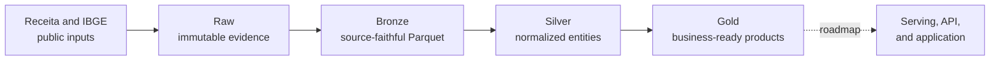

# Atlas

Atlas turns Brazilian public company data into trusted, business-ready datasets. It acquires
monthly Receita Federal and official geography inputs, preserves immutable raw evidence, and
builds quality-gated bronze, silver, and gold data products for company profiles, relationships,
and lead generation.

Atlas is currently a local Scala and Spark data platform. A separate indexer foundation can
fail-closed validate contracted gold bundle inputs, but no serving database or supported query
service exists yet. Serving projections, an API, and an application remain roadmap work.



## Quick start

Atlas requires JDK 17, sbt 1.10 or newer, Python 3, and enough local disk for source archives,
Parquet, and Spark working data.

```bash
./atlas compile
./atlas test
./atlas download receita company-data --release 2026-07
./atlas refresh receita company-data --release 2026-07
./atlas releases validate-bundle --full
./atlas status
```

Downloads use the network and write immutable local raw inputs. Refresh is local-only and publishes
an atomic bundle only after all required components and quality gates succeed. Generated data and
credentials must never be committed.

## Documentation

- [Build and test Atlas](docs/development/building.md)
- [CLI command reference](docs/operations/cli-reference.md)
- [Architecture](docs/architecture.md)
- [Datasets and important fields](docs/manual/datasets.md)
- [Operate the company-data pipeline](docs/operations/company-data-pipeline.md)
- [Query Atlas with DuckDB](docs/manual/querying-atlas.md)
- [Product objective and roadmap](docs/atlas_unified_plan.md)
- [Complete documentation index](docs/index.md)

## Repository layout

- `apps/etl/` — Scala and Spark ingestion, transformation, quality, publication, and export code
- `apps/indexer/` — independent serving contracts and validated gold-bundle reader; projection work is planned
- `apps/etl/data/` — ignored local raw and generated data
- `apps/etl/examples/duckdb/` — executable local inspection and product-query examples
- `docs/manual/` — supported user-visible behavior
- `docs/operations/` — commands, runbooks, recovery, and troubleshooting
- `docs/specs/` — exact dataset, schema, quality, and operational contracts
- `docs/atlas_unified_plan.md` — product direction, MVP objective, and roadmap sequencing

Raw, bronze, silver, gold, exports, and serving projections have separate contracts. Product
surfaces must consume contracted gold data or rebuildable projections of it, never raw files or
ad hoc silver semantics.
