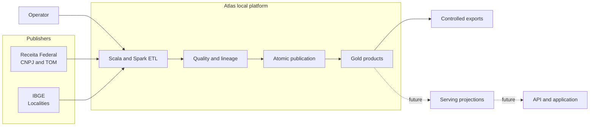
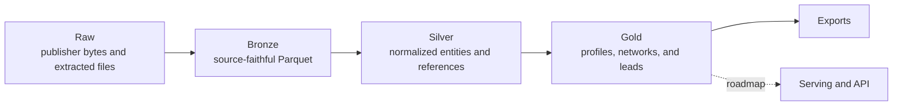
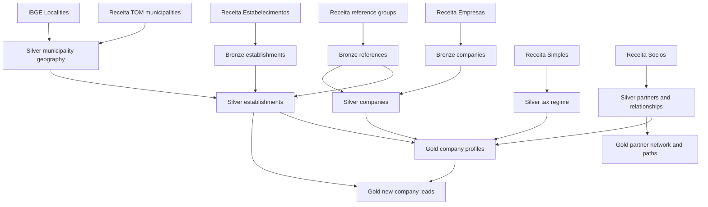
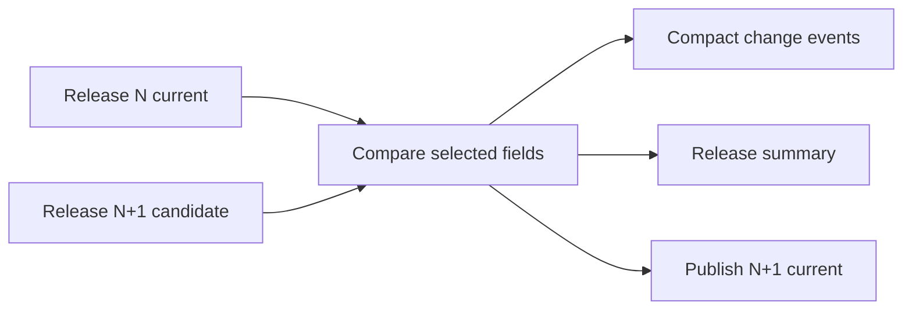
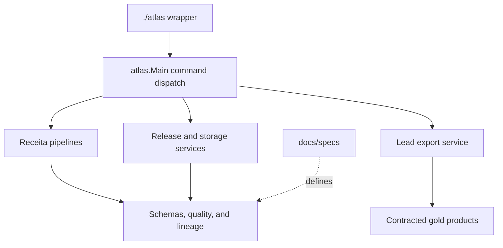

# Atlas architecture

Atlas is a local data platform that converts public Brazilian company snapshots into contracted
gold products. Business meaning is established in versioned data contracts before it is exposed
through exports or future product surfaces.

## System context



Today, `apps/etl` and controlled lead exports are implemented. `apps/indexer` now contains the
independent fail-closed gold-bundle reader foundation, but no serving store or supported query
service. The serving projection, API, and application remain sequenced roadmap components.

## Data pipeline



| Layer | Owns | Must not own |
| --- | --- | --- |
| Raw | Immutable publisher evidence and captured manifests | Repairs or normalization |
| Bronze | Explicit parsing, source meaning, provenance, safe source typing | Cross-entity business semantics |
| Silver | Normalized entities, reference joins, stable keys, reusable quality rules | UI-specific or sellable projections |
| Gold | Contracted business concepts and query-ready products | Source reinterpretation hidden from contracts |
| Serving | Rebuildable indexes optimized for measured access patterns | New business facts |

See [Data layers](manual/data_layers.md) for user-facing behavior and the
[data product contract](data_product_contract.md) for invariants.

## Dataset lineage



The [dataset guide](manual/datasets.md) explains grain and important fields. Exact schemas and
quality behavior remain in [implemented data contracts](index.md#implemented-data-contracts).

## Atomic company-data publication

```mermaid
sequenceDiagram
    participant O as Operator
    participant R as Immutable raw release
    participant W as Staged candidate
    participant V as Validator
    participant B as Bundle registry
    participant C as Current pointer
    O->>R: acquire and verify YYYY-MM
    O->>W: refresh company-data YYYY-MM
    W->>V: validate every required component
    alt all blocking checks pass
      V->>B: publish immutable generation
      B->>C: atomically replace pointer
    else validation fails
      V-->>O: retain diagnostics; current is unchanged
    end
```

The bundle is a consistency boundary, not a data layer. Readers resolve component paths from the
current bundle metadata instead of combining independently discovered outputs. Refresh performs no
network I/O.

## Releases and history



Atlas keeps release-scoped raw and bronze evidence, publishes the current normalized generation,
and records compact selected-field changes instead of retaining every historical full silver
table. Observation changes do not imply exact legal-effective dates.

## Local storage structure

```text
apps/etl/
├── data/
│   ├── raw/receita/<release>/          immutable publisher inputs
│   ├── bronze/receita/...              release-scoped source-faithful Parquet
│   ├── silver/receita/...              current normalized and history data
│   ├── gold/receita/...                current business-ready products
│   └── _atlas/
│       ├── bundles/generations/         immutable published generations
│       ├── quality/ and reports/        generated diagnostics
│       ├── status/                      small run-status records
│       ├── work/                        staged candidates
│       └── _trash/                      recoverable quarantines
├── exports/                             controlled generated exports
└── spark-tmp/                           disposable Spark working data
```

Exact paths are configuration- and contract-owned. Use `./atlas releases inspect-bundle` and
`./atlas storage usage` instead of guessing active paths. Generated data remains outside Git.

## Repository boundaries



- `apps/etl/src/main/scala/atlas` owns production ETL behavior.
- `apps/etl/src/test/scala/atlas` mirrors it with small verifiable tests.
- `apps/indexer` independently consumes versioned bundle file contracts and must not import ETL
  implementation classes.
- `docs/specs` owns published data and operational contracts.
- `docs/manual` explains supported behavior.
- `docs/operations` owns commands, runbooks, and recovery.
- `docs/atlas_unified_plan.md` alone owns product direction and sequencing.

## Safety and future boundaries

Raw data is immutable. Cleanup commands may quarantine or delete only explicitly eligible derived
state and use dry-run defaults where data loss is possible. No current component requires Docker,
cloud infrastructure, streaming, an API, or a UI.

The next product architecture introduces serving only after query patterns are measured. Gold
remains authoritative; a serving database is disposable and must not invent semantics absent from
the gold contracts.
