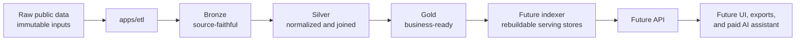
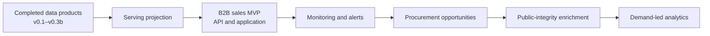

# Atlas unified plan

This is the canonical product and delivery plan for Atlas. Focused documents in this directory expand individual decisions, but this file owns the complete product direction, scope boundaries, dataset sequence, target data products, commercial model, and phased roadmap.

The [Dataset and source catalog](source_catalog.md) is the canonical inventory of named inputs
and their support status, access evidence, licensing notes, and refresh assumptions. Catalog
entries do not change the priorities or sequencing owned here.

## Product thesis

Atlas turns Brazilian public company data into clean company profiles, lead lists, public-data risk flags, procurement intelligence, and graph-ready market intelligence that can be sold through exports, API access, a user interface, and later a paid natural-language query assistant.

Atlas is not a generic data lake or a mirror of public files. Public datasets are inputs. The defensible product assets are the schemas, normalization and entity-resolution logic, quality controls, CNAE groupings, enrichment rules, explainable risk and lead signals, gold-table designs, indexing strategy, serving contracts, and validated query layer.

The first commercial question Atlas should eventually answer well is:

> Which active software companies opened this month in Recife?

Answering it requires trustworthy establishment status, municipality and state, opening date, and primary or secondary CNAE classification. The roadmap is ordered to deliver that capability before expanding into broader intelligence products.

## MVP objective

The Atlas MVP is a distributable company-intelligence product that answers the first commercial
question from contracted gold data through a controlled API and a simple application. It is not
merely a completed ETL job.

The MVP boundary is reached when Atlas can:

- refresh the required Receita identity, company, establishment, reference, geography, and product
  data reproducibly from immutable monthly inputs;
- publish validated gold company profiles and lead results with explicit freshness, quality,
  taxonomy, lineage, and unsupported cases;
- load those gold products into a measured, rebuildable serving projection;
- expose validated search, profile, and lead filters through an API;
- present the same contracted behavior through a minimal application; and
- operate refresh, validation, rollback, and recovery without bypassing a data contract.

The local data foundation and initial gold products are implemented. Graph-ready products,
serving, the API, and the application remain sequenced roadmap work. Risk, procurement, and an AI
assistant are valuable later capabilities, not prerequisites for this MVP.

The first customer prospect is a B2B sales team. The active MVP therefore prioritizes turning the
existing Receita profiles and leads into a usable prospecting workflow before adding more public
datasets. A customer must be able to find, qualify, inspect, and export companies with visible
freshness and source limitations. Recurring monitoring follows the first usable interface because
new-company and company-change alerts create continuing value from Atlas's monthly snapshots.

## Customers and product surfaces

Atlas is intended to support:

- company and establishment search;
- B2B lead generation by geography, sector, status, and opening date;
- business-friendly company profiles;
- explainable public-data risk checks, explicitly not a credit score;
- public procurement and supplier intelligence;
- graph-ready market and geographic aggregates;
- CSV and Parquet exports;
- API access and a web interface after the data products stabilize;
- a paid, gated natural-language query assistant in a later phase.

The ETL is the foundation, not the customer-facing product. UI and API components must consume trusted gold tables or serving stores derived from them; they must never query raw public files directly.

## Architecture and monorepo boundaries

The durable flow is:

The monorepo grows around clear responsibilities:

- `apps/etl`: local Scala/Spark pipelines that produce bronze, silver, and gold data;
- `apps/indexer`: future loaders from gold Parquet into selected serving stores;
- `apps/api`: future search, profile, export, risk, procurement, and query endpoints;
- `apps/ui`: future public site and customer dashboard;
- `packages/domain`: future shared CNPJ, company profile, lead filter, risk flag, and query-intent models;
- `packages/config`: future shared CNAE, municipality, and business-category configuration;
- `docs`: product direction, data contracts, user guidance, operations, and roadmap decisions;
- `infra`: future deployment assets only when deployment becomes an active phase.

Only `apps/etl` and documentation exist today. Documenting future components does not authorize building them early.

## Data layers and product contract

- Raw preserves downloaded source material exactly and remains outside Git.
- Bronze parses source files with explicit schemas, retains source meaning, adds stable identifiers and provenance, and writes Parquet.
- Silver normalizes entities, codes, dates, geography, reference values, and cross-source joins.
- Gold expresses sellable business concepts, query-ready profiles, lead lists, risk flags, supplier profiles, and aggregates.
- Exports are controlled projections of gold tables, not ad hoc raw-file dumps.
- Serving stores are disposable indexes or databases rebuilt from gold tables.

Gold tables are the principal product asset and contract between data engineering and every future product surface.

## Dataset strategy and sequencing

Atlas adds datasets only when they unlock a concrete customer question. It does not ingest every available Brazilian dataset at once.

### 1. Receita Federal CNPJ — identity spine

Receita has the highest priority. It supplies identity, registration status, names, legal attributes, establishments, locations, CNAEs, opening dates, partners, and tax-regime signals.

Important source groups are Empresas, Estabelecimentos, Socios, Simples, CNAE, Municipios, Naturezas Juridicas, Paises, Qualificacoes de Socios, and Motivos de Situacao Cadastral.

v0.1 implemented Estabelecimentos to bronze because it provides the first useful lead dimensions: location, opening date, registration status, primary and secondary CNAE, trade name, email, phone, and headquarters/branch status. The local ETL foundation now also includes silver establishment normalization and compact release-to-release change events for selected establishment fields.

Future Receita silver tables include:

- `silver_company`;
- `silver_establishment`;
- `silver_partner`;
- `silver_company_relationship`;
- `silver_company_tax_regime`;
- `silver_cnae`;
- `silver_municipality`;
- `silver_legal_nature`;
- `silver_partner_qualification`.

### 2. IBGE and reference geography

Geographic enrichment follows the basic Receita pipeline. It resolves municipality, state, and region names; enables normalized location filters; and supports population joins, density measures, regional comparisons, and companies-per-thousand-inhabitants metrics.

The implemented company-data bundle resolves Receita municipality codes through TOM to the IBGE
municipality, state, intermediate-region, immediate-region, and macroregion hierarchy. Population,
area, boundaries, density, and their gold products remain future work.

### 3. CGU and Portal da Transparencia sanctions

CEIS, CNEP, and CEPIM add explainable public-data risk intelligence after a company profile exists. A future `silver_sanction` should preserve source, company identifiers, entity name, sanction type and dates, sanctioning body, process number, and raw source identifier.

A future `gold_company_risk` should expose company identity and registration status, source-specific flags, sanction sources and count, latest sanction date, an explainable risk score, and human-readable reasons.

This must initially be described as source-specific public-integrity records, never as a credit
score or a general claim of trustworthiness. Absence from the captured sources is not a positive
risk finding. A composite score remains outside the active roadmap unless customer research,
legal review, source coverage, calibration evidence, and an explicit versioned contract justify
one.

### 4. PNCP public procurement

PNCP enrichment answers which companies sell to government, where, in what categories, to which buyers, and for what value. A future `silver_public_contract` preserves contract and supplier identity, buyer, value and dates, category, description, and source URL.

A future `gold_public_supplier_profile` aggregates contract counts and values, buyer entities, last contract date, and leading procurement categories by company.

### 5. Graph-ready aggregates

Charts begin as tested gold aggregate tables, not as a dashboard. Planned questions include new companies by month, company counts by sector and location, active versus inactive companies, openings by CNAE group, age distributions, and companies per thousand inhabitants.

### 6. Later optional datasets

- RAIS, CAGED, and Novo CAGED may support public, non-identified employment and labor-market statistics. Atlas must not build employee-level or sensitive-person features.
- ComexStat may support sector, municipality, product, and country trade intelligence.
- CVM may enrich listed and public companies but cannot provide financials for all private companies.
- Banco Central data may add macroeconomic and regional credit-market context, not company-level bureau data.
- DataJud and CNJ data require a separate legal, ethical, product-risk, and technical review before inclusion.

These sources are not early-version implementation targets.

## CNPJ and entity modeling

Atlas always preserves:

- `cnpj_root`: the eight-character uppercase alphanumeric company root;
- `cnpj_branch`: the four-character uppercase alphanumeric establishment order;
- `cnpj_check`: the two check digits;
- `cnpj_full`: the normalized fourteen-character establishment identifier.

Company records are root-level. Establishment records are branch/location-level. Location, CNAE, status, contact, and opening-date searches are generally establishment-level. Atlas must not collapse those concepts into one ambiguous entity.

Normalization trims whitespace, uppercases letters, removes the standard `.`, `/`, and `-` display mask, left-pads under-width components with zeros, and builds `cnpj_full` from root, branch, and check components without numeric conversion. Numeric and alphanumeric identifiers coexist: only the first twelve positions may contain `0-9` or `A-Z`, while the two check positions remain numeric. Identifiers must remain strings. Atlas validates canonical structure but does not validate checksums.

## Corporate relationship and business graph strategy

Corporate structures and business graphs are a major planned Atlas product capability. The first
authoritative source is the reviewed Receita `Socios`/QSA snapshot joined to the company identity
spine. Atlas should first publish source-faithful partner records, then derive deterministic
Brazilian legal-entity-to-legal-entity edges when the participant type is a legal entity and its
CNPJ resolves structurally to an Atlas company.

The normalized relationship contract must preserve:

- participating/source company and QSA target company identifiers;
- participant type, source qualification code, and source qualification description;
- a conservative relationship class that distinguishes ownership or partnership interest,
  partner-administration, management, legal representation, and unknown corporate relationship;
- source dataset, release, record identity, and resolution method;
- first and last observed releases plus explicit observation status;
- reported ownership or voting percentages and reported control only when a source actually
  provides them;
- derivation rule version, evidence source, and confidence for any Atlas-derived assertion.

A QSA relationship is not automatically control. Atlas must not relabel every partner,
administrator, director, president, or legal representative edge as `CONTROLS`. Receita edges
without percentage or explicit control evidence support corporate affiliation and possible
ownership-interest analysis; they do not establish a definitive ultimate beneficial owner.
`POSSIBLE_CONTROL` or a possible control path may be derived only from documented, versioned rules
and must remain visibly distinct from source-reported control.

Monthly snapshots support observation history, not a complete legal transaction ledger. Atlas may
record when an edge was first observed, remained present, changed classification, or disappeared
between releases, but must not infer an exact acquisition, disposal, or legal-effective date when
the source does not provide one.

The first business-graph outputs should support:

- immediate corporate participants and immediate company participations;
- parent-like and subsidiary-like candidate relationships with explicit evidence limitations;
- connected corporate structures and stable component identifiers;
- in-degree, out-degree, component size, and bounded depth metrics;
- circular relationships and cycle membership;
- bounded relationship and possible-control paths such as `A -> B -> C`, including every
  intermediate edge, path depth, weakest evidence/confidence, and cycle detection;
- representative DuckDB queries for corporate structures, shared corporate participants, and
  bounded upstream or downstream traversal.

Atlas must not initially materialize the unrestricted transitive closure of the national graph.
Branching, multiple routes, and cycles can create a combinatorial number of paths. Immediate edges
remain authoritative; recursive exploration starts with measured, configurable depth bounds.
Materialized control paths require a defined customer query, bounded size, reproducible calculation
release, and demonstrated storage and refresh cost.

Natural-person QSA records require a separate privacy and identity-resolution review. Masked CPF
and names are not globally reliable person identifiers, so Atlas must not deterministically merge
people across companies or present probabilistic matches as facts. Foreign participants without a
Brazilian CNPJ require source-scoped Atlas identifiers and remain unresolved unless a later
contracted source provides stronger identity evidence.

After the Receita relationship contract is stable, reviewed CVM ownership and control disclosures
may enrich the smaller set of covered public or regulated companies with reported percentages and
stronger control evidence. GLEIF may later assist Brazilian and foreign legal-entity resolution.
Neither source should block the national Receita relationship graph, and both require exact source,
access, licensing, schema, history, and quality review before implementation.

## Target gold tables

The planned business-ready portfolio includes:

- `gold_company_profile`;
- `gold_leads_new_companies`;
- `gold_company_partner_network`;
- `gold_company_risk`;
- `gold_public_supplier_profile`;
- `gold_company_openings_by_month_city_cnae`;
- `gold_company_count_by_city_cnae_status`;
- `gold_company_age_distribution_by_city`;
- `gold_company_density_by_city`.

The first lead product filters active establishments by city/state, opening-date window, and business-defined CNAE groups such as software services. CNAE group configuration is versioned product logic rather than a hard-coded UI concern.

## Graph strategy

Graph functionality has two distinct meanings in Atlas:

- market and geographic business graphs expressed as reproducible aggregate tables for openings,
  counts, age, sector, location, and density;
- corporate relationship graphs expressed as source-evidenced immediate edges plus measured,
  bounded derived structures and paths.

Both begin as contracted Parquet outputs and DuckDB demonstration queries, not as a graph database
or dashboard. A serving graph technology is selected only after real traversal patterns, graph
size, path depth, refresh cost, and latency requirements are measured. UI charts and interactive
corporate-structure exploration arrive only after the underlying contracts, evidence labels,
quality rules, and refresh behavior are stable.

## Serving and indexing strategy

A future `apps/indexer` reads gold Parquet and loads the serving technology best matched to measured needs. Candidates include PostgreSQL, DuckDB, Meilisearch, ClickHouse, and OpenSearch. No database is selected merely because it is fashionable; query patterns, operating cost, local/deployment constraints, full-text needs, and aggregation workload drive the decision.

Gold remains authoritative. Serving databases and search indexes are derived and rebuildable.

## AI assistant strategy

AI is a later paid and gated product capability because provider calls cost money and create security and reliability obligations.

The assistant translates natural language into a constrained, validated JSON query intent. It must not generate or execute arbitrary SQL. The API validates allowed dimensions, filters, operators, limits, authorization, and cost before querying trusted serving data. Provider keys remain backend-only and must never be exposed to browsers.

Example future intents include active software companies opened this month in Recife, sanctioned suppliers in a state, or procurement-active companies in a sector. The deterministic query layer—not the model—owns data access semantics.

## Current implementation boundary

Atlas currently acquires operator-selected monthly Receita company and establishment inputs and
processes them through bronze and atomic silver publication. The implemented workflow provides:

- restartable, separately manifest-backed acquisition of company-data and establishment inputs;
- release-scoped bronze for establishments, companies, and official reference dimensions;
- normalized companies, establishments, reference dimensions, and TOM-to-IBGE geography;
- compact company and establishment history;
- quality-gated, immutable same-release bundle generations selected by one atomic pointer;
- release inventory, bundle inspection, chronological rebuild, compact status, categorized storage
  usage, and guarded unified cleanup;
- DuckDB guidance for local inspection and acceptance checks.

Refresh never initiates network I/O. Operators acquire and inspect immutable raw input before
publishing derived state. Exact fields, paths, quality behavior, commands, and recovery procedures
belong to the implemented [specifications](index.md#implemented-data-contracts),
[CLI reference](operations/cli-reference.md), and focused runbooks rather than this product plan.

The May–July foundation was operator-accepted with documentation limitations on 2026-07-30.
Routine company-data acquisition now coordinates the company source package and matching
establishments with one explicit-release command before the local-only atomic refresh.

`Simples`, reviewed `Socios`, deterministic corporate relationships, versioned CNAE business
groups, company-profile/partner-network/lead gold, and controlled lead exports are implemented
and were operator-accepted with limitations on 2026-08-08. Serving, API, UI, search, AI, billing,
sanctions, procurement, Docker, cloud deployment,
streaming, and orchestration platforms remain outside the implemented boundary.

## Raw-data safety and migration

Raw public files are large, local, and never committed. They must not be deleted or overwritten during code or layout changes. Moves require source/destination inspection, conflict checks, and post-move file-count and byte-count verification. Interrupted `.part` files remain resumable.

The default local hierarchy stores monthly snapshots beneath `apps/etl/data/raw/receita/<YYYY-MM>`.
Operational migration or recovery details belong in the refresh runbook, not in the product plan.

## Laptop and operational constraints

The target development machine has 32 GB RAM and a 1 TB SSD. Spark runs locally and memory settings remain configurable.

Pipeline rules are:

- never load all datasets into driver memory;
- never call `collect()` on large DataFrames;
- never convert large DataFrames to local Scala collections;
- process file groups incrementally where practical;
- materialize Parquet after major stages;
- separate raw, bronze, silver, gold, and export storage;
- make extracted temporary CSV cleanup possible;
- minimize full shuffles and tiny-file creation;
- keep routine development independent of Docker, cloud services, and clusters.

The selected ETL stack is Scala 2.12, Apache Spark 3.5 locally, sbt, Parquet, Typesafe Config/HOCON, ScalaTest, scalafmt, and optional DuckDB for local inspection.

Kafka, Flink, Spark Streaming, Airflow, Kubernetes, custom databases, and cloud services remain
outside the local foundation.

## Delivery roadmap

### Completed foundation — v0.1 through v0.3a

Atlas has implemented and accepted the local ETL, establishment bronze and silver, compact
establishment history, company and reference ingestion, TOM-to-IBGE geography, compact company
history, and atomic same-release silver bundles. Completed task lists have been removed from the
active roadmap; their behavior and compatibility now belong to the
[implemented specifications](index.md#implemented-data-contracts).

The May–July workflow was operator-confirmed as validated on 2026-07-30. Detailed generated bundle
identifiers, counts, telemetry, and record-level diagnostics remain local and were not supplied for
the documentation change. Routine `download receita company-data` coordinates matching
establishment acquisition and a final same-release readiness check while preserving separate
immutable raw layouts, manifests, resumability, and the establishment recovery command.

### Completed — company products and corporate relationships (v0.3b)

The national 2026-07 bundle was operator-accepted with limitations on 2026-08-08 after full
automated validation and manual inspection. The validator reported 61 passed checks, one warning,
no failures, and one skipped predecessor check. The warning records 51 establishments without an
accepted company; this is a documented possible consequence of whole-root duplicate-company
quarantine. Detailed diagnostics and generated data remain local and are not committed.

- ingest `Simples` and reviewed `Socios` data through source-faithful bronze and contracted silver;
- build deterministic Brazilian company-to-company relationship edges from reviewed QSA legal
  entities while preserving source qualification semantics;
- track release-to-release relationship observations without claiming unsupported legal-effective
  dates;
- classify ownership interest, partner-administration, management, representation, and unknown
  relationships conservatively; do not equate all QSA edges with control;
- build `gold_company_partner_network` as the first corporate relationship and business-graph
  product, including immediate edges, connected corporate structures, component metrics, cycles,
  and tested bounded traversal for relationship or possible-control paths without materializing
  unrestricted transitive closure;
- keep natural-person cross-company resolution outside the deterministic graph pending privacy and
  identity review;
- build gold company profiles and integrate evidence-backed relationship summaries;
- operationalize versioned CNAE business groups;
- build gold lead products and expose controlled lead exports, including the deferred
  `export-leads` command.

Gold remains mandatory before any serving index, API, website, or public product consumes these
data. Silver foundation tables are internal contracts, not customer-facing products.

### Next: v0.4 — serving foundation

- define the supported company-discovery search, company-profile, lead-filter, and export query
  contract over the existing gold products;
- treat relevance-ranked company search as an MVP capability rather than reducing discovery to
  exact identifiers and structured filters: initially cover exact CNPJ, legal-name and trade-name
  matching, documented normalization and typo behavior, deterministic tie-breaking, filter
  interaction, and visible match evidence;
- establish a judged representative search fixture and explicit relevance, latency, rebuild,
  storage, and operational acceptance measures before selecting the search implementation;
- introduce a separate indexer that reads atomic gold bundle generations and builds a disposable
  serving projection without inventing new business semantics; if structured and search
  projections use different technologies, publish and roll them back as one serving generation so
  they cannot expose different gold bundles;
- evaluate both a structured serving store with basic indexed text search and, where the judged
  search workload requires it, a dedicated search engine; select the simplest design that meets
  measured relevance, structured-filter, profile, pagination, export, rebuild, rollback, and
  operating requirements;
- prove full rebuild, generation cutover, rollback, freshness reporting, and query-performance
  behavior on representative and national data;
- keep semantic or vector search, partner-name search, arbitrary keyword search, personalized or
  opaque ranking, and search semantics not backed by the gold contract outside this phase;
- keep public network access, authentication, billing, and customer state outside this phase.

### v0.5 — B2B sales MVP

- expose validated relevance-ranked company search, profiles, lead filters, and bounded exports
  through an API;
- add a minimal application for B2B prospecting using the same public query contract;
- support filters for identity, geography, CNAE business group, registration status, opening date,
  company size, legal nature, and contracted Simples or MEI states where available;
- show source release, freshness, taxonomy version, match evidence, and material limitations;
- validate the first commercial question end to end without querying raw or silver data.

The B2B sales MVP boundary is reached at v0.5. Saved customer state, scheduled delivery, billing,
and broad enrichment are not required to validate the first prospecting workflow.

### v0.6 — monitoring and retention

- add saved searches and explicit company watchlists;
- publish truthful newly observed company, establishment, status, address, CNAE, tax-regime, and
  relationship changes only where the implemented history contracts support them;
- deliver bounded in-application or exportable alerts with release and observation semantics;
- do not describe snapshot observations as legal-effective events or proof of commercial activity.

### v0.7 — procurement opportunity intelligence

- select and contract the exact PNCP and, if justified by measured coverage, Compras.gov inputs;
- prioritize open procurement discovery, buyer history, deadlines, categories, values, and
  deterministic opportunity matching for government suppliers;
- build supplier profiles and Receita-linked buyer, incumbent, and competitor context only from
  source-supported identifiers and facts;
- expose coverage, timeliness, duplicate, cancellation, and unsupported-procurement limitations.

### v0.8 — public-integrity enrichment

- ingest reviewed CEIS, CNEP, and CEPIM inputs;
- add source-specific, dated, attributable public-integrity records to company and supplier
  profiles;
- do not present absence as proof of trustworthiness or introduce an opaque composite risk score.

### v0.9 — demand-led aggregates and graph enhancements

- build openings and company-count aggregates only for validated sales-territory or market-sizing
  questions;
- add age, population, area, density, spatial, or additional materialized graph products only when
  a named customer workflow justifies their source and interpretation cost;
- measure national corporate-graph structure and recursive-query cost before expanding
  materialized paths or selecting graph-specific serving technology.

### Later — paid AI query assistant

- add gated natural-language-to-query-intent functionality;
- enforce backend validation, authorization, limits, and cost controls.

Evaluate labor, trade, public-company financial, macroeconomic, and judicial datasets only against concrete customer demand and legal/ethical constraints.

## Commercial, legal, and IP principles

Atlas is intended as private commercial IP. Do not add public-library boilerplate that implies otherwise. Never commit API keys, provider tokens, credentials, `.env` files, private company data, generated public-data copies, or large runtime artifacts.

Public datasets themselves are not proprietary. Atlas creates value through trusted transformations, unified identifiers, quality and provenance, business taxonomies, explainable scores and signals, query-ready tables, serving design, and product workflows.

Public-data risk outputs must remain factual, explainable, source-attributed, and clearly distinguished from credit scoring. Sensitive or person-level features require legal and ethical review, and are outside the current plan.

## Definition of done and implementation discipline

A phase is complete only when its documented commands work, tests use small in-memory fixtures, configuration and schema changes are documented, data safety has been verified, and the relevant product question can be answered from the intended layer.

Every feature follows the repository [feature development workflow](feature_development_workflow.md): classify, inspect, design and plan proportionately, implement a coherent slice, test, document, compare against the plan, and report evidence and unverified items. Scope may not silently expand into a later phase.

Completed milestones retain their implemented specifications and verification evidence. Active
milestones are complete only when their documented product question can be answered from the
intended layer without bypassing a missing contract.

## Supporting documents

- [Documentation index](index.md)
- [Architecture](architecture.md)
- [CLI reference](operations/cli-reference.md)
- [Feature development workflow](feature_development_workflow.md)
- [Dataset and source catalog](source_catalog.md)
- [Data product contract](data_product_contract.md)
- [Datasets](manual/datasets.md)
- [Receita CNPJ dataset specification](specs/datasets/receita-cnpj.md)
- [Company-data operations](operations/company-data-pipeline.md)
