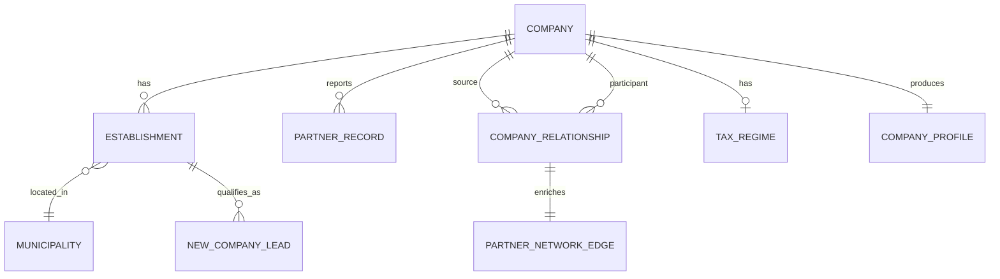

# Atlas datasets

Atlas currently turns the Receita CNPJ company-data family and official geography references into
normalized company intelligence and contracted gold products. This guide describes the datasets
most users need to recognize; exact fields, types, nullability, and quality rules remain in the
[schema contracts](../index.md#implemented-data-contracts).

## Entity model

`cnpj_root` identifies a root-level company. `cnpj_full` identifies one headquarters or branch
establishment. Both remain strings because leading zeros and alphanumeric identifier positions are
significant.

## Raw inputs

| Input | Grain and purpose | Important source attributes |
| --- | --- | --- |
| `Estabelecimentos` | One Receita establishment record | CNPJ components, headquarters/branch, status, opening date, CNAEs, address, contact |
| `Empresas` | One Receita company-root record | CNPJ root, legal name, legal nature, responsible qualification, share capital, size |
| `Socios` | One reported partner record | Source company, participant identity class, name/evidence, qualification, entry date |
| `Simples` | One tax-regime record per source root | Simples and MEI options and dates |
| Six Receita references | Code-to-description rows | CNAE, municipality, legal nature, country, qualification, status reason |
| TOM and IBGE Localities | Municipality mapping and hierarchy | TOM code, IBGE code, municipality, state, immediate/intermediate region, macroregion |

Raw packages and manifests are immutable and release-scoped. See the [source catalog](../source_catalog.md)
for publisher, access, cadence, and redistribution status.

## Bronze datasets

Bronze tables are source-faithful Parquet with explicit columns, normalized identifiers where safe,
source file, release, and ingestion provenance.

| Dataset | Grain / key | Important attributes |
| --- | --- | --- |
| Bronze establishments | Source establishment / `cnpj_full` candidate | CNPJ components, status, dates, CNAEs, address, contact, source file, release |
| Bronze companies | Source company / `cnpj_root` candidate | Legal name, legal nature code, responsible qualification, capital, size, provenance |
| Bronze references | One source code | Code, description, reference type, provenance |
| Bronze partners and tax regime | Source record | Source evidence plus release and file provenance |

Bronze is not guaranteed to satisfy silver uniqueness or domain rules. It preserves evidence needed
to diagnose exclusions and warnings.

## Silver datasets

### Companies

`companies_current` has one accepted row per `cnpj_root`. Important attributes include legal
identity, decoded legal nature and responsible qualification, share capital, company size,
release, record hash, and transformation provenance. All rows belonging to a duplicated root are
quarantined rather than resolved arbitrarily.

Contract: [Silver company](../specs/schemas/silver-company.md).

### Establishments

`establishments_current` has one valid row per `cnpj_full`. Important attributes include
`cnpj_root`, headquarters/branch role, registration status, opening date, primary and secondary
CNAEs, normalized address and contact fields, municipality and state, active flag, release, and
lineage. Invalid identifiers or statuses are quarantined before uniqueness checks.

Contract: [Silver establishment](../specs/schemas/silver-establishment.md).

### Reference dimensions and municipality geography

Reference dimensions decode official Receita codes without inventing business groupings. The
municipality geography table maps Receita TOM municipalities to seven-digit IBGE identifiers and
the official municipality, state, immediate-region, intermediate-region, and macroregion hierarchy.

Contracts: [Reference dimensions](../specs/schemas/receita-reference-dimensions.md) and
[municipality geography](../specs/schemas/receita-ibge-municipality-geography.md).

### Tax regime, partners, and relationships

`company_tax_regime_current` has at most one accepted row per root and preserves nullable Simples
and MEI states: absence is not automatically `false`. `partners_current` preserves one source QSA
record and remains internal. `company_relationships_current` contains deterministic legal-entity
edges from a source company root to a resolved participant company root.

Relationship classes preserve source qualification meaning and do not claim control or ultimate
beneficial ownership. Masked natural-person evidence is not resolved across companies or exposed
through gold exports.

Contract: [Company products](../specs/schemas/receita-company-products.md).

### Compact history

Company and establishment change-event tables store selected old/new field values between observed
releases. Release summaries record counts and change arithmetic. These observations do not establish
exact legal-effective dates, and Atlas does not retain every prior full silver table.

Contracts: [Company history](../specs/schemas/company-change-history.md),
[establishment events](../specs/schemas/establishment-change-events.md), and
[release summaries](../specs/schemas/establishment-release-summaries.md).

## Gold datasets

### Company profiles

`company_profiles_current` has one row per accepted root. It combines legal identity, nullable tax
signals, establishment counts, headquarters summary, relationship counts, release, and rule
version. It is the business-ready company identity product.

### Company partner network and paths

`company_partner_network_current` retains immediate evidence-preserving legal-entity edges and adds
connected-component identifiers, degree and component metrics, and bounded cycle evidence.
`company_relationship_paths_current` stores tested ordered paths through bounded depth. Immediate
relationships remain authoritative; Atlas does not materialize unrestricted transitive closure.

### New-company leads

`leads_new_companies_current` has one row per active establishment and matched, versioned CNAE
business group. Important attributes include company and establishment identifiers, opening date,
CNAE match evidence, official geography, taxonomy version, and release. Because its grain is an
establishment/group match, one company can produce multiple lead rows.

The `export-leads` command applies contracted filters and produces a bounded CSV or Parquet
projection plus a manifest. See [Company products and lead exports](../operations/company-products.md).

## Stage comparison

| Question | Bronze | Silver | Gold |
| --- | --- | --- | --- |
| What did the source report? | Primary owner | Preserved through lineage | Only when relevant to product evidence |
| Is this a valid unique Atlas entity? | Not guaranteed | Yes, under the entity contract | Inherited from silver |
| What does the code mean? | Usually source code | Official reference meaning | Business-friendly projection |
| Is it a software-services lead? | No | No | Yes, under a versioned taxonomy |
| Can an API expose it directly? | No | No | Through a future controlled serving contract |

## Supported, planned, and candidate sources

Receita company data, the reviewed official references, and the current company products are
supported. Graph-ready aggregates are the next roadmap milestone; sanctions, procurement, serving,
API, and application capabilities remain planned. Later public sources are candidates only.

The [unified plan](../atlas_unified_plan.md#delivery-roadmap) alone owns sequencing. The
[source catalog](../source_catalog.md) owns the complete source inventory and evidence.
