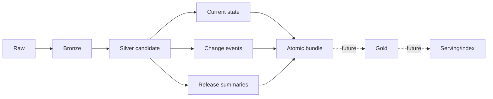

# Local run-status registry

The local status registry reports which dataset snapshot and layer last ran, whether it succeeded, when it finished, how many rows were known, and where its output belongs. It gives future operational tooling and a future dashboard a stable file contract without introducing a database or web application.

Status follows the implemented pipeline structure:



Receita establishments and company data have implemented raw acquisition, bronze and silver
transformations, compact history, release summaries, and atomic bundle publication. Instrumented
jobs record raw, component, and bundle status. Candidate component evidence remains inside its
generation until successful atomic publication activates canonical records. Release summaries are
durable analytical data rather than status records. Gold,
serving/index, and a web dashboard remain roadmap work, so their absence is not a failed run.

From `apps/etl`, list recorded runs with:

```bash
sbt "runMain atlas.Main status"
```

From the repository root, use:

```bash
./atlas status
./atlas status --release 2026-07
./atlas status --verbose
./atlas status --json
```

The command reads `data/_atlas/status`. Its default human view shows a compact row for every
recorded snapshot, then expands component stages and problems for the lexically newest recorded
snapshot. This is deliberately called the newest recorded snapshot rather than the active release:
the registry reports attempts and does not prove that a generation is currently selected or still
exists. `--release YYYY-MM` restricts both sections to one recorded snapshot.

The compact snapshot row reports the recorded atomic bundle outcome, counts component records by
`success`, `success_with_warnings`, and `failed`, counts distinct warning types, and shows the most
recent finish time at UTC minute precision. It does not call the observed stages complete and does
not sum quarantined rows across stages. Silver and history records can describe the same
quarantined source rows, so a cross-stage total could double-count them. Repeated warning evidence
with the same logical dataset, warning type, row count, and report path is displayed once in the
problem detail.

Human labels distinguish the umbrella package from its components: `company source package`
represents `company-data / raw`, `companies` represents the company entity stages, and
`atomic bundle` represents `company-data / bundle`. Existing establishment dataset spellings are
displayed uniformly as `establishments`. These are display labels only; stored JSON identities do
not change.

`--verbose` prints the former full tables. `DATA PIPELINE` contains component stages and measured
row, file, change, quarantine, and warning evidence. `ATOMIC PUBLICATION` contains bundle outcome,
exact finish time, generation path, and a concise failure message. An absent quarantine
measurement displays as `-`, while a measured zero displays as `0`. It may be combined with
`--release YYYY-MM`.

`--json` remains the unmodified registry array for automation and cannot be combined with
`--release` or `--verbose`. Human output is intentionally optimized for operators and is not a
stable machine interface. The command starts no Spark session.

Registry files follow `data/_atlas/status/<source>/<dataset>/<snapshot>/<layer>.json`. For example: `data/_atlas/status/receita/estabelecimentos/2026-06/bronze.json`.

Current identifiers intentionally reflect existing job contracts:

| Operation | `source` | `dataset` | `layer` |
| --- | --- | --- | --- |
| Raw acquisition | `receita` | `estabelecimentos` | `raw` |
| Coordinated company-data acquisition and readiness | `receita` | `company-data` | `raw` |
| Bronze ingestion | `receita` | `estabelecimentos` | `bronze` |
| Silver normalization/publication | `receita` | `establishments` | `silver` |
| Compact change history | `receita` | `estabelecimentos_history` | `history` |
| Company bronze and silver | `receita` | `companies` | `bronze`, `silver` |
| Company change history | `receita` | `companies` | `history` |
| Company reference dimensions | `receita` | `company-references` | `bronze`, `silver` |
| Municipality geography | `receita` | `municipality-geography` | `silver` |
| Atomic company-data publication | `receita` | `company-data` | `bundle` |

The Portuguese source identifier and English silver identifier are established internal status
identities. Consumers should use the full tuple rather than infer data-layer semantics from the
dataset spelling.

Successful refreshes and full rebuilds also record `receita / establishments / <release> / silver` with `data/silver/receita/establishments_current` as the output. Rebuild status paths name active locations after promotion; the temporary rebuild UUID is never retained in activated status metadata.

An integrated download records `receita / estabelecimentos / <release> / raw`. A failed explicit
release is recorded at the same identity. If `--latest` fails before Receita reports a release,
there is no snapshot identity under which Atlas can record that attempt.

The company-data downloader records `receita / company-data / <release> / raw` only after its
source manifest validates, the matching establishment acquisition succeeds, and the final
same-release readiness gate passes. Failure uses the same identity and preserves diagnostics for
`atlas status`. The separate establishment raw status remains visible for component-level recovery.
Successful atomic publication records `receita / company-data / <release> / bundle` and points to
the immutable generation selected by `current_bundle.json`. Component rows and diagnostics are
measured during staging but become canonical only after that same generation is selected.
A failed publication points to its retained failed candidate when one was produced; embedded
component status and warning paths are rewritten to that retained location.

- `success`: the instrumented job completed its output and status publication.
- `success_with_warnings`: the layer was produced, but rows were quarantined or quality warnings were recorded; inspect the warning report paths.
- `failed`: the instrumented job failed; error details are recorded when available, and the command still exits as failed.
- missing: no status file has been recorded for that identity. This is not evidence of success or failure.
- not implemented: the layer or job is outside the current supported implementation. Atlas does not create placeholder records for future work.

A malformed file is reported separately while other valid records remain visible. Each file represents the latest recorded attempt for its source, dataset, snapshot, and layer, not an append-only run ledger or a check that output files still exist. Establishment business history is stored separately as compact change-event and release-summary Parquet under silver.

Durable analytical release metrics live in `data/silver/receita/establishment_release_summaries`; status remains latest-attempt operational metadata. Status JSON is generated operational metadata. It can contain local paths and failure messages, changes whenever jobs run, and is reproducible by running the job. It therefore remains outside Git along with raw input and generated bronze/silver data. See the [run-status contract](../specs/run-status.md) for field-level behavior.

For company silver, `malformed_companies` reports structurally invalid rows and
`duplicate_companies` reports every source row for roots that occurred more than once. Duplicate
groups do not block the bundle: all rows in the group are excluded, the remaining table is
published uniquely, and status is `success_with_warnings`. The displayed quarantine total combines
malformed and duplicate rows; each warning retains its own count and diagnostic path.

Partner silver uses `partner_field_quality_issues` for source fields that cannot be normalized but
do not invalidate the partner record. The warning count is the number of field issues, while the
affected partner rows remain published and do not contribute to `quarantined_row_count`.
