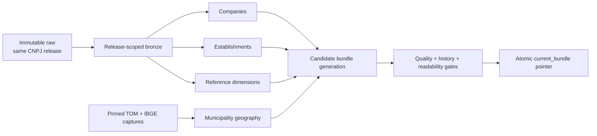

# Company-data and atomic silver bundle runbook

- **Status:** Implemented and accepted
- **Applies to:** v0.3a company-data foundation

This is the operator workflow for building Receita company data through the atomic silver bundle.
Run the dry-run preflight and review its evidence before starting the full Spark rebuild.

## Pipeline and consistency boundary



One bundle contains exactly one CNPJ release. `Empresas`, all six Receita reference groups, and
`Estabelecimentos` must equal that release. TOM and IBGE captures have immutable hashes and capture
times recorded in the bundle. A mixed CNPJ month or unrecorded reference reuse is a hard failure.

## Command surface

```bash
# Network acquisition and raw manifest verification
./atlas download receita company-data --release 2026-07

# Local-only transformation and atomic publication
./atlas refresh receita company-data --release 2026-07

# Metadata inspection without Spark
./atlas releases inspect-bundle
./atlas releases inspect-bundle --release 2026-07

# Chronological backfill/recovery; dry-run is the default
./atlas releases rebuild-company-data --from-release 2026-05 --to-release 2026-07
./atlas releases rebuild-company-data --from-release 2026-05 --to-release 2026-07 --force
```

There is no public `ingest receita company-data` command. Refresh owns all internal bronze
and silver stages so a partial table cannot be mistaken for a published bundle. Existing
establishment ingest, normalize, refresh, and rebuild commands remain recovery tools until the
next compatibility decision changes them. The standalone establishment download command remains
available for establishment-only operation and advanced recovery.

## May–July full-data acceptance

**Decision:** Accepted with documentation limitations on 2026-07-30.

The operator confirmed that the implemented May–July workflow was validated and authorized v0.3a
closure. Generated bundle identifiers, production counts, resource telemetry, and record-level
quality diagnostics remain local and were not supplied for this repository change, so they are not
reproduced or invented here. This limitation affects the durable audit detail, not the implemented
contracts or the operator's acceptance decision. Repeat this acceptance if a material pipeline
change or anomaly calls the baseline into question.

This is a one-time operational acceptance of the v0.3a implementation at national scale. It does
not replace the blocking validation already performed during refresh, and it is not repeated in
full for every later monthly release. Run all commands from the repository root unless a step says
otherwise.

Acceptance is a human decision supported by generated evidence. No command marks a release
accepted automatically. Use one of these outcomes:

- **Accepted:** every required check passes and no material limitation remains.
- **Accepted with limitations:** every blocking check passes and each non-blocking limitation is
  understood, bounded, and recorded.
- **Rejected:** a blocking check fails, evidence is internally inconsistent, or an unexplained
  anomaly makes the foundation unsafe to treat as the supported baseline.

Do not edit raw files, manifests, status records, bundle metadata, quality diagnostics, or Parquet
outputs to make a check pass. Store temporary command output outside the repository, for example
under `/tmp/atlas-acceptance-2026-07`. Do not commit generated data or private records.

### 1. Create an evidence worksheet

Create a local note outside Git with the following fields:

```text
Acceptance scope: 2026-05 through 2026-07
Review date:
Reviewer:
Current bundle ID:
Previous bundle ID:

Raw and manifest verification:
Publication and component status:
Counts and history:
Quality warnings and quarantines:
Geography coverage:
Representative query results:
Storage and resource observations:
Recovery evidence:
Limitations:

Decision: accepted | accepted with limitations | rejected
Decision rationale:
```

Copy bounded summaries into the worksheet. Refer to large or record-level local diagnostics by
path; do not copy source records into Git documentation.

### 2. Confirm storage and release inventory

```bash
./atlas storage usage --release 2026-07 --top 20
./atlas releases list
```

Record filesystem free space and the sizes of raw, bundle, work, bronze, silver, quality, and trash
categories. Passing requires May, June, and July raw inputs to be present and protected, and enough
free space to retain the current and predecessor bundles. `_trash` is not free space. Do not run
cleanup as part of acceptance.

### 3. Review status for every release

```bash
./atlas status --release 2026-05 --verbose
./atlas status --release 2026-06 --verbose
./atlas status --release 2026-07 --verbose
```

For each release, record raw file counts, bronze and silver row counts, history counts, warnings,
quarantined counts, finish times, and output paths. Passing requires successful raw acquisition
for company data and establishments and successful atomic publication of the complete range.
`success_with_warnings` is not an automatic rejection; every warning must be reviewed in step 7.

### 4. Revalidate manifests and rebuild readiness

Run the dry-run only:

```bash
./atlas releases rebuild-company-data \
  --from-release 2026-05 \
  --to-release 2026-07
```

Passing requires the dry-run to list May, June, and July in chronological order and report that raw
archives and captures are verified. This revalidates the local manifest evidence without network
access or data movement.

If a valid May–July bundle is already current, do **not** repeat the command with `--force` merely
for acceptance. A forced rebuild is expensive and creates a new generation. Use it only when the
published range is missing, known to be invalid, or the purpose of the exercise is specifically to
test a full rebuild. When a rebuild is genuinely required, first record the current bundle ID and
retain both the current and predecessor generations until the replacement has been accepted.

### 5. Inspect the bundle chain

```bash
./atlas releases inspect-bundle --release 2026-05
./atlas releases inspect-bundle --release 2026-06
./atlas releases inspect-bundle --release 2026-07
./atlas releases inspect-bundle
```

Record each bundle ID, release, current flag, path, previous bundle ID, source-manifest hashes, and
component list. Passing requires:

- the unqualified inspection and the July inspection to identify the same current bundle;
- May to seed the accepted range, June to follow May, and July to follow June;
- company and establishment source-manifest hashes to be present;
- all required components to be listed and readable;
- no component to mix CNPJ releases.

The bundle path printed here is also the root for staged quality evidence used below. Never assemble
an acceptance view from components belonging to different bundle IDs. Component paths in the JSON
manifest are relative to that bundle root. For example, combine the printed bundle path with
`data/silver/receita/company_release_summaries` to query that generation's company summaries.

### 6. Verify counts and history arithmetic

From `apps/etl`, open DuckDB:

```bash
cd apps/etl
duckdb
```

Run the company-history arithmetic query in
[DuckDB verification examples](#duckdb-verification-examples) against the May, June, and July
summary component paths resolved beneath their respective printed bundle roots. May is the seed and
may have no predecessor comparison. For June and July, passing requires:

```text
current_record_count - previous_record_count = inserted_count - removed_count
```

Apply the equivalent check to establishment release summaries. Compare the summary counts with
`atlas status`; differences require investigation. Record counts and equations, not full query
results containing individual records.

Exit DuckDB with `.quit`, then return to the repository root:

```bash
cd ../..
```

### 7. Review quality evidence

For each release, review the warnings reported by verbose status and the quality paths beneath the
accepted bundle. At minimum:

- compare bronze and silver counts and account for every quarantined row;
- inspect `duplicate_companies` by row count and distinct `cnpj_root`;
- inspect `missing_reference_descriptions` by dimension and code;
- aggregate `partner_field_quality_issues` by field and reason; affected partner rows remain in
  silver with a null normalized field and are not quarantined;
- inspect establishment `malformed_rows` and any duplicate-key diagnostic;
- read `municipality_geography_coverage.json`;
- record `state_conflict`, reviewed-override, carried-forward, and unresolved counts.

Use the bounded diagnostic queries under
[DuckDB verification examples](#duckdb-verification-examples). Do not export unrestricted
diagnostics. Passing requires zero blocking quality failures, zero unresolved municipality
coverage for used non-null codes, and a written explanation for every non-blocking warning.

### 8. Run representative bundle queries

Using paths from the same accepted bundle, run the first three
[DuckDB verification examples](#duckdb-verification-examples):

1. establishment-to-company join coverage;
2. active establishments by official geography;
3. company legal-nature coverage.

Also run one bounded lead-like inspection:

```sql
SELECT
  g.state_abbreviation,
  g.ibge_municipality_name,
  e.opening_date,
  e.main_cnae,
  COUNT(*) AS establishments
FROM read_parquet('<establishments_path>/**/*.parquet') e
JOIN read_parquet('<municipality_geography_path>/**/*.parquet') g
  ON e.municipality_code = g.receita_municipality_code
WHERE e.registration_status_code = '02'
  AND e.opening_date >= DATE '2026-07-01'
  AND e.opening_date < DATE '2026-08-01'
GROUP BY 1, 2, 3, 4
ORDER BY establishments DESC
LIMIT 20;
```

This is an inspection, not a gold lead contract. Passing requires readable outputs, credible
geography and reference values, and no unexplained join or null pattern. Record aggregated,
bounded results and observations.

### 9. Record resource and recovery evidence

Use status timestamps and any retained Spark logs to record approximate runtime and any observed
memory pressure, spill, retry, or disk issue. Missing historical peak-memory or spill metrics do
not require a rebuild; record them as unavailable and decide whether that limitation is acceptable.

Record the recovery evidence actually demonstrated:

- refresh retained immutable raw inputs and verified their hashes;
- publication selected one complete generation atomically;
- the current manifest records its predecessor;
- the predecessor remains present and protected;
- automated tests cover failed-candidate and pointer-restoration behavior, if verified for the
  reviewed revision.

Do not switch the live pointer solely to manufacture rollback evidence. If no live rollback was
performed, state that explicitly as a limitation rather than claiming it occurred.

### 10. Make and record the decision

Choose one acceptance outcome and complete every worksheet field. Reject when a blocking invariant
fails or a material anomaly remains unexplained. Use **accepted with limitations** when blocking
validation passes but evidence such as historical resource telemetry or a live rollback exercise
is unavailable.

After an accepted decision, update the foundation delivery record, unified plan, source catalog,
manual limitations and dataset status, documentation index, and this runbook in one documentation
change. State the reviewed releases, bundle ID, decision date, key counts, warnings, limitations,
and verification commands. Do not publish local paths, raw records, credentials, or generated
Parquet. After a rejected decision, leave “acceptance pending” in place and record the blocker and
required remediation without broadening the supported product surface.

Later monthly releases use the normal refresh gates plus a lightweight comparison with the
previous release. Repeat this full acceptance only after a material change to source layout,
schema, transformation, quality, history, publication semantics, or execution infrastructure, or
when an anomaly calls the accepted baseline into question.

The `missing_reference_descriptions` quality diagnostic is non-blocking. It records company codes
that Receita uses in `Empresas` but omits from the same release's reference dimension. The silver
company preserves the code and publishes a null description; operators should compare counts and
codes between releases. Blank or conflicting reference-dimension rows still block publication.

The `duplicate_companies` diagnostic is also non-blocking. When structurally valid `Empresas` rows
share a `cnpj_root`, Atlas writes every source row in the group to the diagnostic and excludes the
entire root from `companies_current`. It never selects a survivor. Review both quarantined row
counts and distinct key counts because one omitted company can account for several source rows.
An establishment that no longer matches a company may be explained by this quarantine and must
not be interpreted as proof that the company closed.

Municipality geography is bundle-blocking. Inspect
`data/_atlas/quality/receita/company-data/<release>/municipality_geography_coverage.json` and the
adjacent Parquet diagnostic when coverage fails. The report separates current TOM, reviewed
override, carried-forward, and unresolved establishment counts and includes bounded unresolved
examples. Do not edit the captured TOM CSV or establishment data to make the gate pass.

Rows with `coverage_status = 'state_conflict'` are diagnostic-only. They identify establishment
rows whose non-null UF disagrees with the official state of the resolved municipality. Review
their counts and source records, but do not rewrite either source value; these rows do not block
an otherwise complete bundle.

Short numeric TOM values are normalized to four digits automatically. A mapping omitted from the
current TOM capture may be carried from the latest earlier bundle only when the current capture
does not contradict it and the selected IBGE capture still contains its IBGE municipality.
Never add a mapping by name similarity. A new reviewed exception requires exact TOM and IBGE codes,
release validity, authoritative evidence in
`src/main/resources/atlas/receita/tom-municipality-overrides.csv`, focused tests, and contract
review. TOM `1182` / IBGE `5101837` for Boa Esperança do Norte is the initial reviewed exception.

For later months, run the coordinated company-data download and one refresh. Refresh rejects equal
or older releases. A month gap is permitted only when history records the actual previous bundle
and the selected release is complete.

## Failure and recovery

- Preflight, transformation, or validation failure leaves `current_bundle` unchanged.
- Component status is staged with the candidate. Failed candidates retain those diagnostics but
  do not replace the active component rows shown by `atlas status`; bundle failure remains visible
  and points to the retained failed candidate when available.
- A failed read after pointer switch restores the recorded previous pointer.
- Retry creates a new generation; it never overwrites failed output or raw inputs.
- Rebuild publishes only after the complete requested range succeeds; it never splices partial new
  history into the active bundle.
- Cleanup requires dry-run, explicit `--force`, a recovery window, and protection for raw, active,
  predecessor, and transaction-journal paths.
- Failed candidates are retained under `data/_atlas/bundles/failed` for diagnosis. Use
  `./atlas storage cleanup` to inspect them together with existing trash. Force first quarantines
  eligible failed candidates; a later cleanup invocation may permanently delete that quarantine.
  Never delete the complete failed-bundle directory manually.

### Corporate component convergence

The company network propagates the smallest company CNPJ root through each undirected connected
structure until a confirmation round changes zero labels. Progress output reports the release,
round, and exact changed-node count. The default safety allowance is 128 changing rounds:

```hocon
atlas.graph.max-component-propagation-rounds = 128
```

This setting protects an operator from an unexpectedly deep or defective calculation. It does not
limit component size, relationship-path depth, or JVM memory. Change it only with evidence from a
retained failed candidate and record the chosen value with the run evidence. A failure reports the
release, configured allowance, changed nodes in the confirmation round, and iteration-artifact
path. Retry only after correcting the implementation or deliberately adjusting the configured
allowance; increasing `--memory` does not change graph convergence.

## DuckDB verification examples

Resolve paths through `inspect-bundle`; never guess paths or combine independently current tables.
Replace each placeholder with a path printed for one bundle ID.

Check that establishments join to their root company:

```sql
SELECT
  COUNT(*) AS establishments,
  COUNT(c.cnpj_root) AS matched_companies,
  COUNT(*) - COUNT(c.cnpj_root) AS missing_companies
FROM read_parquet('<establishments_path>/**/*.parquet') e
LEFT JOIN read_parquet('<companies_path>/**/*.parquet') c
  ON left(e.cnpj_full, 8) = c.cnpj_root;
```

Inspect active establishments by official geography:

The exterior sentinel appears as `state_abbreviation = 'EX'`, a null
`ibge_municipality_name`, and `is_exterior = true`.

```sql
SELECT
  g.state_abbreviation,
  g.ibge_municipality_name,
  g.is_exterior,
  COUNT(*) AS active_establishments
FROM read_parquet('<establishments_path>/**/*.parquet') e
JOIN read_parquet('<municipality_geography_path>/**/*.parquet') g
  ON e.municipality_code = g.receita_municipality_code
WHERE e.registration_status_code = '02'
GROUP BY 1, 2, 3
ORDER BY active_establishments DESC
LIMIT 20;
```

Inspect company legal-nature coverage:

```sql
SELECT legal_nature_code, legal_nature_description, COUNT(*) AS companies
FROM read_parquet('<companies_path>/**/*.parquet')
GROUP BY 1, 2
ORDER BY companies DESC
LIMIT 20;
```

Inspect missing reference-description diagnostics when that path exists:

```sql
SELECT dimension, code, COUNT(*) AS companies
FROM read_parquet('<quality_path>/missing_reference_descriptions/**/*.parquet')
GROUP BY 1, 2
ORDER BY companies DESC;
```

Inspect quarantined duplicate companies when that path exists:

```sql
SELECT
  cnpj_root,
  duplicate_group_size,
  duplicate_business_variant_count,
  COUNT(*) AS quarantined_rows,
  list(DISTINCT source_file) AS source_files
FROM read_parquet('<quality_path>/duplicate_companies/**/*.parquet')
GROUP BY 1, 2, 3
ORDER BY quarantined_rows DESC, cnpj_root;
```

Verify non-seed company history arithmetic:

```sql
SELECT
  previous_record_count,
  current_record_count,
  inserted_count,
  removed_count,
  current_record_count - previous_record_count AS observed_delta,
  inserted_count - removed_count AS event_delta
FROM read_parquet('<company_summary_path>/**/*.parquet');
```

These are internal acceptance queries, not a public query contract or gold product. Their field
names follow the implemented contracts linked from the documentation index.

## Operational UI boundary

No dashboard is required for this phase. `atlas status`, bundle inspection, manifests, reports,
and DuckDB provide sufficient visibility for a local monthly workflow. A future read-only UI may
be considered after scheduling or multi-operator use exists, but it must read the same metadata and
must not publish, repair, or bypass the CLI transaction protocol.
