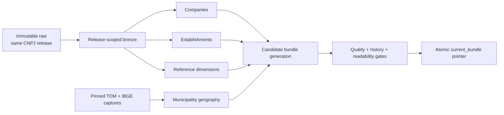

# Company-data and atomic silver bundle runbook

- **Status:** Implemented; full May–July production acceptance remains operator-run
- **Applies to:** v0.3a company-data foundation

This is the operator workflow for building Receita company data through the atomic silver bundle.
Run the dry-run preflight and review its evidence before starting the full Spark rebuild.

## Pipeline and consistency boundary



One bundle contains exactly one CNPJ release. `Empresas`, all six Receita reference groups, and
`Estabelecimentos` must equal that release. TOM and IBGE captures have immutable hashes and capture
times recorded in the bundle. A mixed CNPJ month or unrecorded reference reuse is a hard failure.

## Command surface

```bash
# Implemented today: network acquisition and raw manifest verification
./atlas download receita company-data --release 2026-07
./atlas download receita estabelecimentos --release 2026-07

# Local-only transformation and atomic publication
./atlas refresh receita company-data --release 2026-07

# Metadata inspection without Spark
./atlas releases inspect-bundle
./atlas releases inspect-bundle --release 2026-07

# Chronological backfill/recovery; dry-run is the default
./atlas releases rebuild-company-data --from-release 2026-05 --to-release 2026-07
./atlas releases rebuild-company-data --from-release 2026-05 --to-release 2026-07 --force
```

There is no planned public `ingest receita company-data` command. Refresh owns all internal bronze
and silver stages so a partial table cannot be mistaken for a published bundle. Existing
establishment ingest, normalize, refresh, and rebuild commands remain recovery tools until the
bundle workflow is accepted and a later compatibility decision changes them.

## First May–July build after implementation

1. Confirm capacity for raw inputs, bronze, a complete staged bundle, the active generation, Spark
   spill, and rollback retention. Do not count `_trash` as free space.
2. Run `./atlas status`. Require successful company-data and establishment raw status for May,
   June, and July, plus existing establishment outputs or rebuildable establishment raw inputs.
3. Inspect every source manifest. Confirm release, required groups, members, sizes, hashes, and
   TOM/IBGE identities. Never edit a manifest to make it pass.
4. Run the rebuild without `--force`. Review inputs, generation paths, filesystem/device
   checks, estimated storage, predecessor order, and retained outputs.
5. Repeat with `--force`. May seeds state; June compares with May and July with June. The command
   performs no network access.
6. Inspect the bundle. Require July to be current, all required components present, all CNPJ
   releases equal to July, hashes readable, and predecessors ordered May to June to July.
7. Review quality reports, quarantines, history arithmetic, and representative queries. Retain the
   prior generation until acceptance is recorded; always retain raw inputs.

The `missing_reference_descriptions` quality diagnostic is non-blocking. It records company codes
that Receita uses in `Empresas` but omits from the same release's reference dimension. The silver
company preserves the code and publishes a null description; operators should compare counts and
codes between releases. Blank or conflicting reference-dimension rows still block publication.

For later months, explicitly download both source groups and run one refresh. Refresh
rejects equal or older releases. A month gap is permitted only when history records the actual
previous bundle and the selected release is complete.

## Failure and recovery

- Preflight, transformation, or validation failure leaves `current_bundle` unchanged.
- Component status is staged with the candidate. Failed candidates retain those diagnostics but
  do not replace the active component rows shown by `atlas status`; bundle failure remains visible
  and points to the retained failed candidate when available.
- A failed read after pointer switch restores the recorded previous pointer.
- Retry creates a new generation; it never overwrites failed output or raw inputs.
- Rebuild publishes only after the complete requested range succeeds; it never splices partial new
  history into the active bundle.
- Cleanup requires dry-run, explicit `--force`, a recovery window, and protection for raw, active,
  predecessor, and transaction-journal paths.

## DuckDB verification examples

Resolve paths through `inspect-bundle`; never guess paths or combine independently current tables.
Replace each placeholder with a path printed for one bundle ID.

Check that establishments join to their root company:

```sql
SELECT
  COUNT(*) AS establishments,
  COUNT(c.cnpj_root) AS matched_companies,
  COUNT(*) - COUNT(c.cnpj_root) AS missing_companies
FROM read_parquet('<establishments_path>/**/*.parquet') e
LEFT JOIN read_parquet('<companies_path>/**/*.parquet') c
  ON left(e.cnpj_full, 8) = c.cnpj_root;
```

Inspect active establishments by official geography:

The exterior sentinel appears as `state_abbreviation = 'EX'`, a null
`ibge_municipality_name`, and `is_exterior = true`.

```sql
SELECT
  g.state_abbreviation,
  g.ibge_municipality_name,
  g.is_exterior,
  COUNT(*) AS active_establishments
FROM read_parquet('<establishments_path>/**/*.parquet') e
JOIN read_parquet('<municipality_geography_path>/**/*.parquet') g
  ON e.municipality_code = g.receita_municipality_code
WHERE e.registration_status_code = '02'
GROUP BY 1, 2, 3
ORDER BY active_establishments DESC
LIMIT 20;
```

Inspect company legal-nature coverage:

```sql
SELECT legal_nature_code, legal_nature_description, COUNT(*) AS companies
FROM read_parquet('<companies_path>/**/*.parquet')
GROUP BY 1, 2
ORDER BY companies DESC
LIMIT 20;
```

Inspect missing reference-description diagnostics when that path exists:

```sql
SELECT dimension, code, COUNT(*) AS companies
FROM read_parquet('<quality_path>/missing_reference_descriptions/**/*.parquet')
GROUP BY 1, 2
ORDER BY companies DESC;
```

Verify non-seed company history arithmetic:

```sql
SELECT
  previous_record_count,
  current_record_count,
  inserted_count,
  removed_count,
  current_record_count - previous_record_count AS observed_delta,
  inserted_count - removed_count AS event_delta
FROM read_parquet('<company_summary_path>/**/*.parquet');
```

These are internal acceptance queries, not a public query contract or gold product. Field names
must be verified against the final implemented contracts.

## Operational UI boundary

No dashboard is required for this phase. `atlas status`, bundle inspection, manifests, reports,
and DuckDB provide sufficient visibility for a local monthly workflow. A future read-only UI may
be considered after scheduling or multi-operator use exists, but it must read the same metadata and
must not publish, repair, or bypass the CLI transaction protocol.
