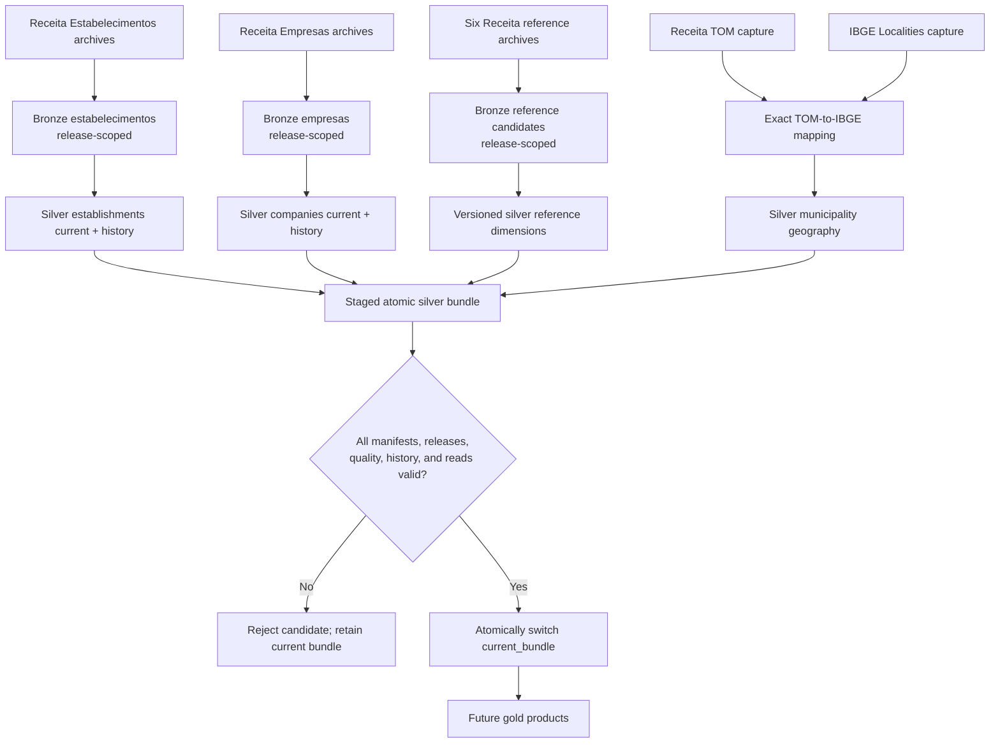
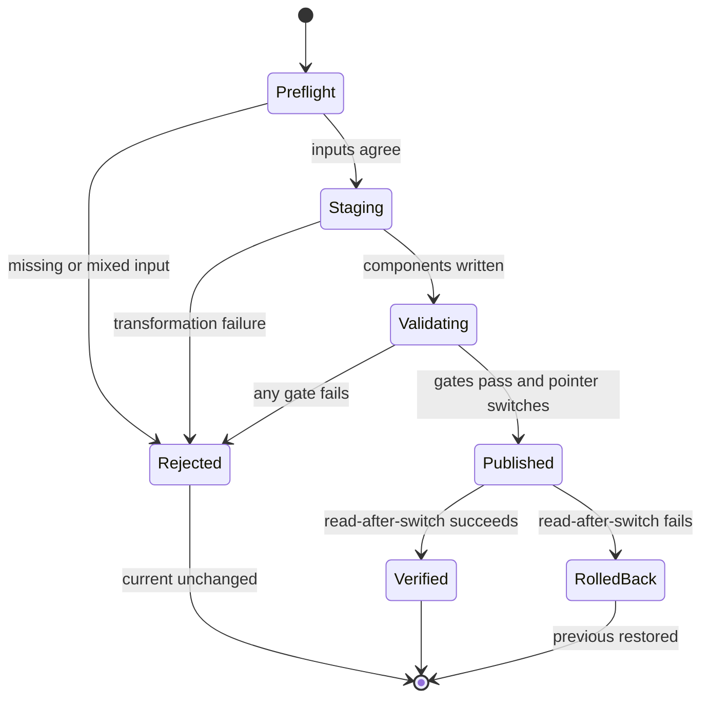

# Receita company data foundation

**Status: Implemented; full-data acceptance pending**
**Roadmap owner: Atlas unified plan**  
**Implementation state: Transformations, history, and atomic bundle publication implemented**
**Current implementation slice: Operator-run May–July full-data acceptance**

The raw-to-bundle workflow is implemented. Full-data counts, performance, quality evidence, and
disk observations remain to be recorded by the operator-run May–July acceptance before this tranche
is treated as production-accepted.

## Decision and objective

Atlas will prioritize reusable company data coverage before a customer-facing lead export. The
v0.3a objective is to produce a coherent, reproducible silver foundation for May, June, and July:
root-level companies from `Empresas`; the six official Receita reference groups; a deterministic
Receita/TOM-to-IBGE municipality hierarchy; compact company change history; and an atomic bundle
that ties those outputs to the existing establishment state.

Success means an operator can acquire declared official inputs, build each release chronologically,
validate cross-table relationships, and either publish the complete bundle or leave the previous
bundle untouched. `export-leads` is intentionally deferred until gold company products in v0.3b.

## Non-goals

This tranche does not implement `Simples`, `Socios`, partner networks, CNAE business groupings,
gold tables, lead exports, population, areas or boundaries, OpenSearch, any other serving store,
API, website, dashboard, AI, sanctions, procurement, Docker, cloud, scheduling, or orchestration.
It does not change raw data, expose silver as a public product, or make redistribution claims.

## Source inventory and official evidence

The [source catalog](../source_catalog.md) owns the exact input inventory, support state, official
evidence, cadence, and redistribution status. The [source interpretation
contract](../specs/datasets/receita-company-reference-sources.md) owns layouts, snapshot agreement,
manifest requirements, and the gate that must pass before bronze ingestion. In summary, a bundle
requires same-release `Empresas`, the six Receita references, and supported `Estabelecimentos`, plus
captured TOM and IBGE geography inputs. Runtime inputs remain immutable outside Git; population and
boundaries are excluded.

## Planned data flow and outputs



All CNPJ-derived components in a bundle use one exact operator-selected `YYYY-MM` release:
`Empresas`, the six Receita reference groups, and `Estabelecimentos`. TOM and IBGE Localities are
publisher-controlled reference captures rather than monthly CNPJ releases. A bundle pins their
exact hashes, retrieval timestamps, and manifest identities. Reusing a reference capture across
CNPJ releases is permitted only when the bundle records it explicitly and the geography quality
gate passes; it is never inferred or silently carried forward.

### Raw and bronze

Raw acquisition extends the existing restartable manifest pattern without altering previously
downloaded bytes. `Empresas` follows the [raw layout](../specs/schemas/raw-receita-empresas.md)
and writes release-scoped [bronze](../specs/schemas/bronze-receita-empresas.md). Each of the
six reference groups receives source-faithful release-scoped bronze output. TOM and IBGE responses
are captured as immutable reference inputs, not fetched during refresh.

### Silver company and history

The [`silver_company`](../specs/schemas/silver-company.md) contract defines the latest valid root-level
company state keyed by `cnpj_root`. It resolves only official descriptions needed by the company
record. May seeds current; June and July produce compact events and durable summaries under the
[company history contract](../specs/schemas/company-change-history.md). Full historical copies are
not retained after publication.

### Reference and geography

The six [Receita dimensions](../specs/schemas/receita-reference-dimensions.md) remain
release-versioned. The [geography table](../specs/schemas/receita-ibge-municipality-geography.md)
uses exact identifiers to expose municipality, immediate region, intermediate region, state, and
macroregion. It does not use fuzzy names or contain population, area, geometry, or density.

### Bundle publication

A release bundle records one immutable bundle identifier and the exact release/hash of:

- establishment current state and its existing history summary;
- company current state and company history summary;
- all six Receita reference dimensions;
- the TOM and IBGE geography captures and resulting municipality hierarchy;
- quality reports, schema/status versions, and producer version.

Consumers resolve a single `current_bundle` pointer and never assemble independently current
tables. Gold and public consumers remain forbidden until their roadmap phase and contracts exist.

The bundle is a silver publication boundary, not a gold table. Future gold jobs read one resolved
bundle identifier and produce separately contracted business-ready products.

The bundle manifest must include:

- a stable manifest schema version, immutable `bundle_id`, target CNPJ release, creation time, and
  producer version;
- every component's logical name, schema version, release or reference-capture identity, path,
  content hash, row count, and quality-report path;
- the previous bundle identifier used for company and establishment history comparison;
- source-manifest hashes for `Estabelecimentos`, company-data, TOM, and IBGE inputs;
- publication outcome and the exact staged-generation path.

`current_bundle` is a small atomic pointer to an immutable generation. Component paths beneath a
published generation are never overwritten. Publication validates the staged manifest, promotes
the generation on the same filesystem, atomically replaces the pointer, and performs a
read-after-switch check. Cross-filesystem promotion is unsupported because it cannot provide the
required rename semantics.

The implementation should use a versioned layout beneath `data/_atlas/bundles`: unique staging
generations under `staging/<bundle_id>`, immutable published generations under
`generations/<bundle_id>`, a versioned `bundle-manifest.json` inside each generation, and one small
`current_bundle.json` pointer. The manifest stores component paths rather than requiring every
Parquet table to live beneath the metadata directory. A filesystem lock covers preflight through
pointer verification. Because generations are immutable and become visible only through the
pointer, an interruption before the pointer swap leaves an unreferenced generation rather than a
partially active bundle.

## Operator interfaces

The following interfaces are implemented:

```text
./atlas download receita company-data --release YYYY-MM
./atlas refresh receita company-data --release YYYY-MM
./atlas releases rebuild-company-data --from-release 2026-05 --to-release 2026-07
./atlas releases inspect-bundle --release YYYY-MM
```

`download` is the only command allowed network access. `refresh` is the normal local-only entry
point: it validates both raw manifests, builds release-scoped bronze candidates, produces every
silver component, validates the candidate, and publishes only a release newer than current.
`rebuild-company-data` preflights an explicit inclusive range and reconstructs it chronologically.
`inspect-bundle` reads manifests and small metadata without Spark; omitting `--release` should
inspect the current pointer.

A public `ingest receita company-data` command is intentionally removed from the proposal. A
bronze-only checkpoint is useful internally but is not a complete operator outcome. Existing
establishment commands remain available for recovery and compatibility until bundle refresh passes
full-data acceptance; normal operations then use company-data refresh to coordinate both entities.

## May–July backfill

The initial implementation target requires protected raw inputs for `2026-05`, `2026-06`, and
`2026-07`. Preflight verifies every required archive and hash before Spark work. May builds the
seed company state and receives a release summary but no mass insert events. June compares May to
June; July compares June to July. Establishment state/history already published for those months
must be validated and incorporated, not silently recomputed under changed semantics.

If existing establishment artifacts cannot satisfy the bundle manifest, implementation must stage
an explicit compatible rebuild from protected raw data and report it as data movement. Missing
months, mixed releases, or missing reference captures stop the three-month backfill.

The initial operational sequence after implementation is:

1. Inspect raw status and all three company-data and establishment manifests.
2. Dry-run the May-through-July rebuild to verify hashes, disk space, filesystem boundaries, and
   the active generation.
3. Build May as the seed bundle without mass insert events.
4. Build June against May, then July against June, preserving predecessor bundle IDs.
5. Inspect July as current, run representative DuckDB checks, and retain rollback data until the
   acceptance evidence has been reviewed.

## Publication and recovery model

Each refresh writes to a unique staging generation. The job validates schemas, quality gates,
referential coverage, readable Parquet, summaries, and bundle-manifest hashes before atomically
switching the `current_bundle` pointer. The prior generation remains recoverable until the new
pointer and post-publication read check succeed.

Failure before the pointer swap leaves current untouched and records a failed run plus diagnostics.
Failure after the swap triggers pointer rollback to the recorded prior generation; neither raw
inputs nor previously valid history are deleted. Retry uses a new staging generation. Orphaned
staging data is removable only through a guarded derived-data cleanup command with dry-run support.



## Compatibility and data movement

This additive plan does not change the implemented establishment schema, existing commands, or raw
layout. New silver/reference paths are internal and initially have no compatibility guarantee.
Introducing `current_bundle` changes future publication coordination, so implementation must
version the manifest and keep current establishment readers working until they deliberately adopt
bundle resolution.

The May–July backfill reads immutable raw data and creates new bronze, silver, reference, history,
report, staging, and manifest artifacts. It must not move, rewrite, or delete raw files. Before any
derived migration, implementation records source/destination counts and bytes, collision checks,
available disk space, and rollback location. No generated data is committed.

## Quality gates

The [company and geography rules](../specs/quality/company-geography-quality-rules.md) are
bundle-blocking. In addition to per-table schema and key checks, publication requires:

- all declared input manifests and hashes, with a single CNPJ release;
- unique valid company roots and dimension codes;
- no ambiguous TOM-to-IBGE mapping and complete coverage for municipality codes used by candidate
  establishments;
- company reference integrity for required legal-nature and qualification joins;
- history arithmetic consistent with previous/current row counts;
- all bundle components readable and named in the manifest;
- no mutation of protected raw paths and no network access during refresh.

Diagnostics include counts and bounded generated evidence. Threshold changes require an update to
the owning contracts before behavior changes.

## Automated acceptance checks

Small in-memory fixtures must cover numeric and alphanumeric roots, blanks, invalid widths and
characters, decimal-comma capital, duplicate roots, reference duplicates and misses, TOM/IBGE exact
joins, hierarchy extraction, May seeding, June/July insert-update-remove events, unchanged releases,
mixed-release rejection, failed publication, rollback, and deterministic rebuild output.

Focused parser/schema/transformation tests run first. Because implementation changes Scala ETL,
`sbt test` must pass from `apps/etl`, followed by CLI help and dry-run checks proving the
commands are discoverable and refresh performs no network access.

CLI tests must also prove that refresh rejects an equal or older release, mixed CNPJ releases,
missing manifests, an unpinned reference capture, a cross-filesystem generation root, and any
attempt to publish only a subset of required components.

## Full-data acceptance checks

An operator-run May–July acceptance records, for every release and dataset, archive counts and
hashes, source and accepted row counts, quarantine counts, distinct keys, duplicate conflicts,
reference misses, geography coverage, event counts, summary arithmetic, Parquet sizes, elapsed
time, peak practical resource observations, and final bundle contents. SQL spot checks inspect
representative companies and establishments across UFs and both numeric/alphanumeric identifier
forms.

Acceptance also verifies raw file counts and bytes are unchanged, only one coherent bundle is
visible, the previous generation can be restored, no unexpected network call occurred, and local
disk usage remains within the documented 32 GB RAM / 1 TB SSD operating target. Results and any
unsupported cases become implementation evidence in the owning specs and operations guidance.

## Implementation slices

1. Contract and fixture baseline: finalize source/version details and executable fixture checks.
2. Bronze engine: validate both raw manifests, stream ZIP members without mutating raw data, write
   release-scoped candidates, and make retries deterministic.
3. Reference/geography: build versioned dimensions and exact TOM-to-IBGE hierarchy with gates.
4. Company silver: normalize, resolve references, quarantine, and validate current company state.
5. Coordinated establishment input: validate or stage the matching establishment release and its
   existing history without changing established field semantics.
6. History: add compact May–July company events and summaries tied to predecessor bundle IDs.
7. Bundle publication: define the manifest and generation layout; stage, validate, atomically
   switch, read-check, roll back, and expose metadata-only inspection.
8. CLI integration: implement local-only refresh, dry-run rebuild, chronological rebuild, and
   guarded cleanup while retaining establishment recovery commands.
9. Backfill and documentation: run full-data acceptance and update manuals only for commands that
   have become implemented.

Each slice must update its owning specification and focused tests in the same change. An
implementation request may deliver smaller coherent slices, but may not bypass a missing contract
or present partially assembled state as a published bundle.

Slice 1 precedes all new bronze ingestion. Its Scala declarations are side-effect-free schemas,
and its committed inputs are synthetic fixtures. The versioned
[source-manifest contract](../specs/schemas/receita-company-source-manifest.md) now validates local
archives, ZIP membership, hashes, strict parser behavior, TOM, and IBGE hierarchy without altering
raw data.

The acquisition prerequisite is implemented as
`./atlas download receita company-data --release YYYY-MM`. It resumes immutable downloads,
captures TOM and IBGE, writes the manifest only after strict validation, and records status.
Transformation remains blocked until the selected-release manifest validates successfully;
synthetic tests are not substitutes for full-data acceptance evidence.

## Dashboard decision

A dashboard is unnecessary for v0.3a. The pipeline is operator-triggered, local, and monthly; the
CLI, status registry, immutable manifests, quality reports, bundle inspection, and DuckDB checks
cover its control and evidence needs. A dashboard would add UI, API, authentication, and process
control before the data contract is stable. Reconsider a read-only operational UI only after
automation or multiple operators create a measured need. It must consume the same metadata and
must never become an alternative publication path.

## Deferred work

v0.3b owns `Simples`, reviewed `Socios`, gold company profiles, partner networks, business CNAE
groups, gold leads, and `export-leads`. Gold must precede OpenSearch or any other serving index,
API, website, dashboard, or public product. Population, boundaries, density, sanctions,
procurement, and AI retain their later unified-plan phases.
