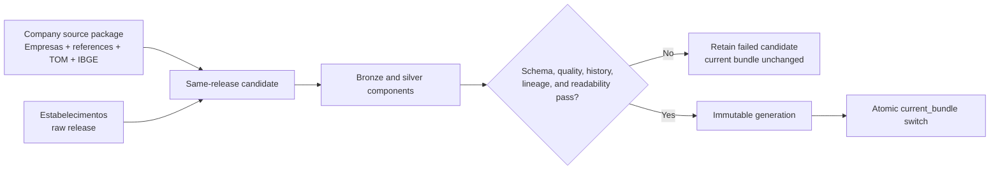

# Receita company-data foundation delivery record

- **Status:** Completed and operator-accepted
- **Roadmap milestone:** v0.3a
- **Purpose:** Historical decision and handoff record

The company-data foundation is implemented through atomic silver publication. This page records
the delivered boundary and completion decision; it no longer repeats schemas, quality rules,
commands, or recovery behavior owned by active specifications and operations guides.

## Delivered boundary

Atlas can acquire immutable, manifest-backed `Empresas`, six Receita reference groups, TOM, and
IBGE Localities inputs; combine them with the matching `Estabelecimentos` release; and publish one
coherent silver bundle containing companies, establishments, reference dimensions, municipality
geography, compact history, quality evidence, and lineage.

The design deliberately keeps raw acquisition separate from transformation, requires an exact
CNPJ release across monthly inputs, pins reference captures by hash, and exposes a single bundle
pointer so consumers cannot assemble mixed-release current tables.

## Completion record

The May–July national-scale workflow was operator-confirmed as validated and accepted with
documentation limitations on 2026-07-30. Generated bundle identifiers, production counts,
resource telemetry, and record-level diagnostics remain local and were not supplied for this
repository change; Atlas does not invent or commit them.

The normal `download receita company-data` workflow now coordinates the existing establishment
acquisition for the exact release and applies a final readiness check across both separately
preserved raw layouts and manifests. The standalone establishment downloader remains an advanced
recovery command. These changes complete the v0.3a exit checks.

Gold company profiles, `Simples`, `Socios`, corporate relationship graphs, CNAE business groups,
and lead exports belong to v0.3b. Serving, API, and UI remain later roadmap work.

## Active owners

- Product priority and remaining sequence: [Atlas unified plan](../atlas_unified_plan.md#delivery-roadmap)
- Operator commands and acceptance procedure:
  [company-data bundle runbook](../operations/company-data-pipeline.md)
- Source inventory and interpretation:
  [dataset catalog](../source_catalog.md) and
  [company/reference source specification](../specs/datasets/receita-company-reference-sources.md)
- Schemas and quality rules: [documentation index](../index.md#company-data-specifications)
- Publication, failure, and cleanup behavior:
  [company-data bundle runbook](../operations/company-data-pipeline.md#failure-and-recovery)

This record is not an additional contract. If it conflicts with an active specification or
runbook, the active owner wins.
